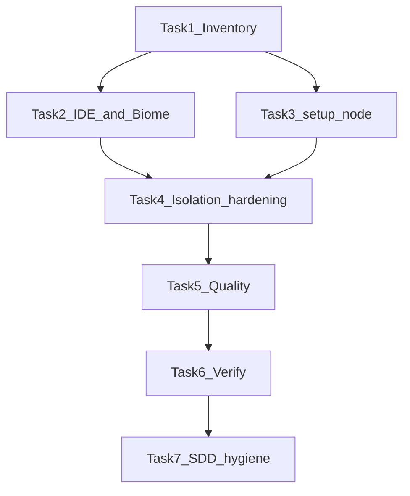

# Problems, Review, and Fix Plan

> **For agentic workers:** REQUIRED SUB-SKILL: Use superpowers:subagent-driven-development. Work in place (do not create a git worktree — `tauri:dev` is already running). Do **not** create git commits unless the user explicitly asks. User instructions override the SDD “commit per task” default.

**Goal:** Identify and clear the 45 Problems-panel items, fix real security/bugs (Must Fix) and justified quality/performance issues (Should Fix), then prove the workspace is green with the project test workflow.

**Architecture:** Read-only review already found a solid Tauri security baseline (object-form CSP + `devCsp`, Isolation allowlists, `withGlobalTauri: false`, opener scoped to one GitHub URL, pty/fs ungranted). The 45 Problems are **not** visible to `ReadLints`. [Explore TS/JS diagnostics](c09dc588-8461-44ee-a320-9e4ee069ac1e) found no unused-import/`any`/`tsc` cluster; the count matches built-in CSS misreading Tailwind v4 `@theme` in [`globals.css`](packages/ui-kit/src/styles/globals.css) (55 theme tokens) plus missing capability JSON schemas and Biome a11y on the side-panel `
`. Execution is inventory-first, then clustered fixes, then verification.

**Tech Stack:** Biome 2.5.8, TypeScript 7, Vitest 4, Tailwind 4, Tauri 2, rustc stable + clippy `-D warnings`, pnpm 11 / turbo.

## Global Constraints

- Object-form CSP and `devCsp`; Isolation IPC; `withGlobalTauri: false`; never `window.__TAURI__` in app code
- Capabilities `"windows": ["main"]` only; never `core:default`; do **not** grant `gencore-pty` / `gencore-fs` stub commands
- `opener:allow-open-url` stays scoped to `https://github.com/ATOMANGELETTI/GenCore` only
- UI talks to Rust only through `src/modules/ipc/` wrappers
- Official Nord hex; Terminess Nerd Font from `@gencore/ui-kit` only; CSP `font-src` stays `'self'`
- Folder-per-module naming; tests only under each unit’s `tests/`
- Latest stable only; no major version bumps; no new dependencies unless a Must Fix requires one
- Do not implement a real PTY or file manager
- Superpowers artifacts only under [.superpowers/docs/plans/2026-08-16-ide-problems-security-quality.md](.superpowers/docs/plans/2026-08-16-ide-problems-security-quality.md) and [.superpowers/sdd/ide-problems-security-quality/](.superpowers/sdd/ide-problems-security-quality/). Do not create `docs/plans` or `docs/specs`. Do not dump new briefs at `.superpowers/sdd/task-*`. Do not copy this Cursor `.plan.md` into `.superpowers/docs/` as a second file.
- No commits unless the user asks; conventional commits if they later do
- Orchestration: Grok 4.6 extra high for implementers and reviewers. Use Kimi K3 or GLM 5.2 only if Grok cannot do the task. Elevate to Opus 5 / Sonnet 5 / GPT 5.6 only if those fail. After each task: `tauri-reviewer` for Tauri/capability diffs, `ui-kit-reviewer` for ui-kit diffs. Final pass: Bugbot + Security Review + requesting-code-review

---

## Review findings (this session)

ReadLints is empty. Security baseline on both apps is in good shape. Findings below are from source review, Biome/Tauri docs, and prior SDD notes.

### Must Fix (security / bugs / broken lint or CI)

1. **Composite action passes both Node version inputs** — [`.github/actions/setup-node-pnpm/action.yml`](.github/actions/setup-node-pnpm/action.yml) always sets `node-version: ${{ inputs.node-version }}` (default `""`) **and** `node-version-file: .node-version`. setup-node treats both as supplied; an empty override can win over `.node-version`. This is a real CI footgun and matches the GitHub Actions Problems this repo has already seen on that file.
2. **Biome indexes unknown file types** — [`biome.json`](biome.json) has `files.ignoreUnknown: false` (Biome’s default) and `includes: ["**"]`. Biome docs: that combination emits diagnostics and can fail the CLI for file types it cannot process (`.rs`, `.toml`, `.yml`, fonts, etc.). This is the strongest explanation for a large Problems-panel count that `ReadLints` does not show.
3. **Known ui-kit format failure** — [`packages/ui-kit/src/styles/globals.css`](packages/ui-kit/src/styles/globals.css) `--font-sans` / `--font-mono` lines exceed `lineWidth: 100`. Prior SDD recorded `biome check` failing on this wrap. `lint-staged` also omits `*.css`, so the failure survives commits.
4. **Side-panel resize `
` fails Biome a11y** — [`side-panel.component.tsx`](apps/terminal/src/modules/side-panel/side-panel.component.tsx) lines 212–229 put `tabIndex`, pointer/keyboard handlers, and `aria-valuemin/max/now` on a non-interactive `
`. Likely `noNoninteractiveElementInteractions`, `noNoninteractiveTabindex`, and `useAriaPropsSupportedByRole`. Replace the handle with an element that can be a slider (for example a `div` with `role="slider"`), and keep existing resize tests passing.
5. **Capability `$schema` points at a gitignored file** — both [`apps/terminal/src-tauri/capabilities/main.json`](apps/terminal/src-tauri/capabilities/main.json) and Explorer’s copy use `"$schema": "../gen/schemas/desktop-schema.json"`. `**/src-tauri/gen/` is gitignored, so a clean checkout (and often the Problems panel) shows “Unable to load schema”. Point `$schema` at a schema that exists in-repo or at the official Tauri URL; do not commit the whole `gen/` tree.

### Should Fix (quality / performance / defense in depth)

1. **Isolation hooks allowlist commands only** — [Explore Tauri security config](603b1cb6-01c9-4237-9f0d-abf9200659c1) confirmed no Must Fix ACL/CSP holes. Both hooks still return the original payload after a `cmd` check. Reconstruct `{ cmd, callback, error, payload, options }`; pin `plugin:opener|open_url` to `https://github.com/ATOMANGELETTI/GenCore`; require empty/absent args for window chrome and `get_app_info`. Make the terminal hook as strict as Explorer (`typeof cmd === "string"`). Add tests that the isolation allowlist, capabilities, and UI command set stay in sync (no pty/fs, no `core:default`).
2. **Clipboard probe reads clipboard contents** — [`canReadClipboard()`](apps/terminal/src/modules/context-menu/context-menu.clipboard.ts) calls `navigator.clipboard.readText()` on every menu open. That is a privacy/perf smell; prefer a permission query or enable Paste without reading contents first.
3. **Inconsistent app-info error UX** — Explorer surfaces `getAppInfo` failures; Terminal only `console.error`s. Align Terminal with Explorer (no version in the statusbar; titlebar still owns the version).
4. **Stale / inconsistent docs** — [apps/terminal/src/modules/ipc/ipc.app-info.ts](apps/terminal/src/modules/ipc/ipc.app-info.ts) still says it is the only IPC call (opener exists). [AGENTS.md](AGENTS.md) Learned User Preferences still says “Terminus Nerd Font”. [`.superpowers/sdd/progress.md`](.superpowers/sdd/progress.md) still mentions MIT from the bootstrap era (repo is GPL-3.0-or-later).
5. **IDE Tailwind CSS noise** — [`.vscode/settings.json`](.vscode/settings.json) has no `css.lint.unknownAtRules: "ignore"` and no `tailwindCSS.experimental.configFile` pointing at `packages/ui-kit/src/styles/globals.css`. Built-in CSS will warn on `@theme` / `@source` plus the 55 `@theme` tokens (the best match for “45 Problems”). Also set `typescript.tsdk` to the workspace TypeScript 7.0.2.
6. **Isolation hooks use `var`** — Biome `noVar` on [terminal isolation.hook.js](apps/terminal/isolation/isolation.hook.js) and [explorer isolation.hook.js](apps/explorer/isolation/isolation.hook.js). Use `const`/`let` (classic script is still fine in WebView).
7. **AppShell sidebar truthiness** — [app-shell.component.tsx](packages/ui-kit/src/composites/app-shell/app-shell.component.tsx) uses `sidebar ?` instead of `sidebar != null` (prior review minor).
8. **CSP hardening is implicit** — both `tauri.conf.json` files rely on `default-src: 'self'` for script/frame/form/worker. Add explicit `script-src: "'self'"`, `frame-ancestors: "'none'"`, `form-action: "'none'"`, `worker-src: "'none'"` to **both** `csp` and `devCsp`. Do **not** set `frame-src: 'none'` (Isolation iframe). Keep `style-src` with `'unsafe-inline'`.
9. **`data-tauri-drag-region` is an IPC exception** — titlebar drag invokes `plugin:window|start_dragging` without `ipc.window.ts`. Keep the capability. Document the exception in `AGENTS.md` / `.cursor/rules/security.mdc`, and add `startDraggingWindow()` wrappers for completeness.
10. **Side-panel resize listener is duplicate** — [`side-panel.component.tsx`](apps/terminal/src/modules/side-panel/side-panel.component.tsx) uses both `window.resize` and `ResizeObserver`. Keep only `ResizeObserver`. Optionally cache `getCurrentWindow()` in both `ipc.window.ts` files.

### Not changing (in scope as “leave alone”)

- Do not grant `gencore-pty` / `gencore-fs`. Default permission files are correctly empty.
- Do not remove scoped `opener:allow-open-url` — the version badge uses it via [`ipc.opener.ts`](apps/terminal/src/modules/ipc/ipc.opener.ts).
- Do not downgrade `actions/checkout@v7` / `actions/setup-node@v7` unless inventory proves they are invalid. Extension “unable to resolve action” is often catalog lag.
- Do not implement real PTY/FS I/O.
- Do not rewrite context menus. The side-panel change is limited to the resize handle element (a11y), dropping the extra `window.resize` listener, plus existing tests.
- Do not add `TAURI_DEV_HOST` websocket origins to production `csp`. Document that env as unsupported for HMR, or leave `devCsp` localhost-only (current, stricter).
- Do not add COEP. Keep `Cross-Origin-Opener-Policy: same-origin`.

---

## File map (expected)

- Create: `.superpowers/docs/plans/2026-08-16-ide-problems-security-quality.md` (one dated plan; no matching spec unless a design decision appears)
- Create: `.superpowers/sdd/ide-problems-security-quality/` (briefs, reports, inventory, review diffs)
- Modify: `.superpowers/sdd/progress.md` — add a feature block for this work; fix the leftover MIT mention there
- Modify: `biome.json` — `ignoreUnknown: true`; exclude `**/*.{rs,toml,yml,yaml,md,ttf,png,ico,ps1}` from processing if needed
- Modify: `.vscode/settings.json` — `css.lint.unknownAtRules: "ignore"`, `tailwindCSS.experimental.configFile` → `packages/ui-kit/src/styles/globals.css`, `typescript.tsdk` → workspace TypeScript
- Modify: `package.json` `lint-staged` — include `*.css`
- Modify: `packages/ui-kit/src/styles/globals.css` — wrap font stacks to 100 columns
- Modify: both `apps/*/src-tauri/capabilities/main.json` `$schema` to a resolvable schema
- Modify: `apps/terminal/src/modules/side-panel/side-panel.component.tsx` — slider-capable resize handle (not `
`)
- Modify: `.github/actions/setup-node-pnpm/action.yml` — pass only one of `node-version` / `node-version-file`
- Modify: both `isolation/isolation.hook.js` files and `isolation/index.html` (unify script placement)
- Modify: both `tauri.conf.json` — explicit CSP deny directives on `csp` and `devCsp`
- Create: `apps/terminal/tests/unit/isolation.hook.test.ts` and `apps/explorer/tests/unit/isolation.hook.test.ts` (or one shared assertion style in each app)
- Modify: both `ipc.window.ts` — `startDraggingWindow()` + cache `getCurrentWindow()`
- Modify: `.cursor/rules/security.mdc` and `AGENTS.md` — document `data-tauri-drag-region` as the allowed start-dragging exception
- Modify: `apps/terminal/src/modules/context-menu/context-menu.clipboard.ts` + its tests
- Modify: `apps/terminal/src/modules/app/app.component.tsx` — surface app-info errors like Explorer
- Modify: `AGENTS.md` Terminess wording; `ipc.app-info.ts` comment; `progress.md` MIT leftover
- Modify: `app-shell.component.tsx` — `sidebar != null` if tests already allow it
- Test: existing package tests; add/adjust isolation and clipboard tests under `apps/*/tests/`

---

### Task 1: Inventory the 45 Problems

**Files:** Create `.superpowers/sdd/ide-problems-security-quality/inventory.md` only (no product code).

**Interfaces:** Produces a counted list: source (Biome / tsc / clippy / CSS / GitHub Actions), severity, file:line, whether it is a real defect or IDE false positive.

- [ ] Run, from repo root (do not pass `--write` / `--fix`):
  - `pnpm exec biome check --max-diagnostics=200 .`
  - `pnpm turbo run lint typecheck`
  - `pnpm turbo run test` only after listing lint/typecheck (or scoped if a package is red)
  - `cargo clippy --workspace --all-targets -- -D warnings` and `cargo test --workspace` if the `tauri:dev` lock allows; otherwise note the lock and retry
- [ ] Record the exact diagnostic count and messages in `inventory.md`. Map each cluster to Task 2–5. If the 45 are a single cluster (e.g. all Biome unknown-file), collapse later tasks rather than inventing work.
- [ ] Do not change product code in this task.

### Task 2: Clear Biome / CSS / schema Problems

**Files:** `biome.json`, `.vscode/settings.json`, `package.json` (lint-staged), `packages/ui-kit/src/styles/globals.css`, both `capabilities/main.json`, `apps/terminal/src/modules/side-panel/side-panel.component.tsx` + `apps/terminal/tests/unit/side-panel.test.tsx`

- [ ] Set `files.ignoreUnknown` to `true`. Keep `includes` excluding `node_modules` / `dist` / `target` / `.turbo`. Add `!**/*.{rs,toml,yml,yaml,ttf,png,ico}` if Task 1 still shows unknown-file noise.
- [ ] In `.vscode/settings.json`: `"css.lint.unknownAtRules": "ignore"`, `"tailwindCSS.experimental.configFile": "packages/ui-kit/src/styles/globals.css"`, `"typescript.tsdk": "node_modules/typescript/lib"`. Do not disable Biome CSS linting.
- [ ] Wrap the two font-stack custom properties in `globals.css` to `lineWidth` 100. Keep the exact `Terminess Nerd Font` family and system fallbacks (must stay in sync with [`tokens.typography.ts`](packages/ui-kit/src/tokens/tokens.typography.ts)).
- [ ] Add `*.css` to root `lint-staged` biome check.
- [ ] Fix both capabilities `$schema` values so JSON LS can resolve them without committing `src-tauri/gen/`.
- [ ] Replace the side-panel `
` resize handle with a `role="slider"` control (keep `data-slot="side-panel-resize"`, aria-valuemin/max/now, keyboard + pointer behavior). Update tests that query the handle. Run `pnpm --filter @gencore/terminal test` and `pnpm exec biome check` on that file.
- [ ] Re-run `pnpm --filter @gencore/ui-kit lint` and `pnpm exec biome check packages/ui-kit/src/styles/globals.css`. Expected: clean.

### Task 3: Fix setup-node composite action

**Files:** `.github/actions/setup-node-pnpm/action.yml`

- [ ] Never pass `node-version` and `node-version-file` on the same step.
- [ ] When `inputs.node-version` is empty, use only `node-version-file: .node-version`. When it is non-empty, use only `node-version`.
- [ ] Keep Corepack + frozen lockfile + pnpm cache behavior unchanged.
- [ ] Do not add `core:default`, secrets, or extra permissions.

### Task 4: Isolation hardening, CSP, and sync tests

**Files:** both `isolation/isolation.hook.js`, both `isolation/index.html`, both `tauri.conf.json`, new tests under `apps/*/tests/unit/`, existing `tauri.conf.test.ts` files

- [ ] Both hooks: reject unless `typeof payload.cmd === "string"` and cmd is in the allowlist. Replace `var` with `const`/`let`. Return a **new** object (`cmd`, `callback`, `error`, `payload`, `options`) — do not return the original payload.
- [ ] For `plugin:opener|open_url`, allow only `https://github.com/ATOMANGELETTI/GenCore`. For window chrome and `get_app_info`, require empty or absent args.
- [ ] Unify isolation `index.html` script placement (one pattern for both apps).
- [ ] Add explicit CSP deny directives to both `csp` and `devCsp` on both apps: `script-src: "'self'"`, `frame-ancestors: "'none'"`, `form-action: "'none'"`, `worker-src: "'none'"`. Do not set `frame-src: 'none'`. Do not add websocket localhost to production `connect-src`.
- [ ] Tests: isolation allowlist, `capabilities/main.json`, and UI command set match; opener URL equals `GENCORE_REPO_URL`; no `gencore-pty` / `gencore-fs` / `core:default` / `opener:default`.
- [ ] Do not add pty/fs commands to the allowlist.

### Task 5: Quality and consistency

**Files:** clipboard module + tests; Terminal `app.component.tsx` + tests; `ipc.app-info.ts` comment; `AGENTS.md`; `.superpowers/sdd/progress.md`; optionally `app-shell.component.tsx`.

- [ ] Stop reading clipboard text just to enable Paste. Keep Cut/Copy gated on `hasTextSelection()`. Update [`context-menu.content.test.tsx`](apps/terminal/tests/unit/context-menu.content.test.tsx) — the current test that expects `readText` on open must change.
- [ ] Terminal: show a content-area error string when `getAppInfo` fails (same pattern as Explorer). Do not put the version in the statusbar.
- [ ] Fix the stale “only IPC call” comment; say Terminess (not Terminus) in AGENTS.md Learned User Preferences; remove the MIT leftover in the SDD progress ledger. Document `data-tauri-drag-region` as the allowed `start_dragging` exception in `AGENTS.md` and `.cursor/rules/security.mdc`. Add `startDraggingWindow()` to both `ipc.window.ts` files and cache `getCurrentWindow()`.
- [ ] Change AppShell `sidebar ?` to `sidebar != null` only if existing ui-kit tests still pass.
- [ ] Side panel: drop the `window.resize` listener; keep `ResizeObserver` only. Document that `TAURI_DEV_HOST` HMR is unsupported (devCsp stays localhost).

### Task 6: Verification

- [ ] `pnpm turbo run lint typecheck test`
- [ ] `cargo test --workspace`
- [ ] `cargo clippy --workspace --all-targets -- -D warnings`
- [ ] Confirm Problems-panel drivers from Task 1 are gone (Biome CLI count, format clean, setup-node YAML valid).
- [ ] Dispatch read-only `tauri-reviewer` + `ui-kit-reviewer` on the diff, then one Bugbot (`Diff: uncommitted changes`) and one Security Review (`Diff: uncommitted changes`). Fix only Critical/Important. Do not edit on reviewer say-so for nits without listing them.

### Task 7: Superpowers hygiene

- [ ] Write the long-form plan to `.superpowers/docs/plans/2026-08-16-ide-problems-security-quality.md` only. Do not add a spec unless a new design decision appears. Do not create `docs/plans` or `docs/specs`.
- [ ] Keep all new briefs/reports/inventory under `.superpowers/sdd/ide-problems-security-quality/` and append a feature block to `.superpowers/sdd/progress.md`.
- [ ] Move loose SDD-root leftovers (`task-*.md` and `review-*.diff` that are not inside a named feature folder) into `.superpowers/sdd/archive/bootstrap/`. Leave organized complete folders as-is: `terminess-font/`, `context-menus/`, `side-panel-resize/`, `side-panel/`, `dev-live-reload/`, `gilded-version-badge/`.

## Execution

After you approve this plan: Superpowers SDD in this session, one Grok 4.6 extra high implementer per task, review after each task, no commits unless you ask. Two options at approval time are the same pipeline — SDD is the default.
