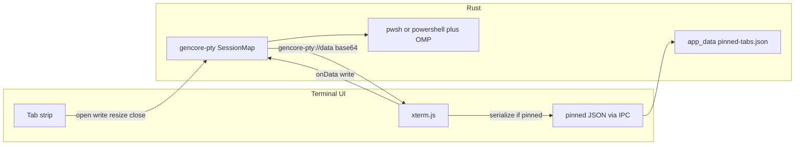

# Terminal window (xterm.js + portable-pty)

Date: 2026-08-20
Status: approved
Packages: `@gencore/terminal`, `@gencore/ui-kit`, crates `gencore-pty` and `gencore-core`

## Problem

The Terminal right pane is still centered template copy. `gencore-pty` is a registered stub (`open` / `write` / `resize` / `close` all `NotImplemented`). Isolation and capabilities grant none of those commands. There is no emulator, no session tabs, and no persistence.

## Goals

- A real terminal in the right `ContentArea`: **xterm.js** in the UI, **portable-pty** (ConPTY on Windows) in `gencore-pty`.
- Session tabs at the top of that pane: create, close, rename, pin. Pinned tabs sit on the left with a pin glyph.
- Pinned tabs survive restart: custom name, last working directory, and visible scrollback. A new shell starts under a visible session seam. Unpin or close drops the saved record.
- New unpinned tabs start in the user home directory. Shell is **system `pwsh` if on PATH, otherwise Windows PowerShell 5.1**. Do not bundle PowerShell 7.
- Two-line **Oh My Posh** prompt, **capsule** segments (rounded pills), Nord Polar Night / Snow Storm palettes, Nerd Font icons. Prompt restyles when the OS theme changes. Bundle `oh-my-posh.exe` plus two GenCore theme JSON files in the Terminal portable app.
- Chrome: **nord1 tab strip**, **nord2 pill** for the active tab, frost selected text, 2px `primary` underline not required on pills (fill is the selection). Terminal canvas is nord0 / nord6.
- Titlebar copy stays `Tauri Terminal Template` plus `get_app_info` version. Placeholder center copy goes away.

## Non-goals

Split panes, search, command palette, clickable URLs (opener stays GitHub-only), file-tree “Open in Terminal”, drag-reorder tabs, per-tab private Up-arrow history, bundling PowerShell 7, Explorer PTY, `gencore-fs` `stat`, `window.__TAURI__`, `core:default`, `opener:default`, theme picker, Settings-tab persistence.

## Approach

Four layers. The kit never talks to Tauri. The PTY plugin never knows about React or Oh My Posh themes by path from the UI (it receives a config path from the app at spawn). Terminal owns tabs, xterm, prompt env, and pinned JSON.

1. `gencore-pty` — real sessions: spawn, write, resize, close, emit output/exit.
2. Terminal Isolation + capabilities + `ipc.pty.ts` + app-local pinned-store commands.
3. Terminal `terminal` module — tab strip, xterm host, persistence orchestration, OMP env.
4. `@gencore/ui-kit` — add **Terminess Nerd Font Mono** for the emulator canvas only. Chrome keeps the existing Terminess (non-Mono) cut. No shared Tabs primitive.

## Units

### gencore-pty (crate)

- **Does:** Manage a `SessionMap` of portable-pty pairs. Commands stay `open`, `write`, `resize`, `close` (do not add `spawn` / `kill`).
- **Use:** Terminal UI only. Explorer does not register grants.
- **Depends on:** `portable-pty` (latest stable), existing Tauri/serde/thiserror.

`open` returns `{ session_id }` (UUID string). `OpenArgs`: `cols`, `rows`, optional `cwd`. **No shell path from the UI.** Rust resolves `pwsh` then `powershell`. If `cwd` is omitted or not a directory, use the user profile directory.

`write` takes `{ session_id, data }` as UTF-8 text from xterm `onData`.

Output is **not** UTF-8-safe. Emit `gencore-pty://data` with `{ session_id, data }` where `data` is **standard base64** of the raw byte chunk. Emit `gencore-pty://exit` with `{ session_id, code }` (`code` is `i32` or `null` if unknown).

Reader thread per session (same spirit as `gencore-fs` watch + `spawn_blocking` / dedicated thread). Plugin `setup` `app.manage`s the session map. `close` kills the child, joins the reader, removes the map entry. Dropping the last window must not leak processes: `close` every session on plugin teardown.

Typed errors replace `NotImplemented`: `SessionNotFound`, `SpawnFailed`, `Io`, `InvalidCwd`, `Unsupported` as needed. Serialize as today (`Display` string) unless a structured form is already required by sibling plugins; stay consistent with `gencore-fs`.

Default ACL stays **empty**. New permissions are the existing generated `gencore-pty:allow-open|write|resize|close`.

### gencore-core pinned store

- **Does:** `load_pinned_tabs` / `save_pinned_tabs` for `{app_data_dir}/pinned-tabs.json` only.
- **Use:** Terminal persist. Explorer does not grant these.
- **Depends on:** `AppHandle` path resolver. No PTY types. Keep `get_app_info` on default ACL; do **not** add these commands to `gencore-core:default`.

### Isolation and capabilities (Terminal)

Grant only when `ipc.pty.ts` / `ipc.pinned.ts` exist and the UI calls the commands:

- `gencore-pty:allow-open`, `allow-write`, `allow-resize`, `allow-close`
- `gencore-core:allow-load-pinned-tabs`, `allow-save-pinned-tabs`
- Keep existing `core:event:allow-listen` / `allow-unlisten`

Isolation allowlist adds `plugin:gencore-pty|open|write|resize|close`. Reconstruct:

- `open`: always `{ cols, rows }`. Optional `cwd` string uses the same path rules as `gencore-fs` (length 1..32767, no NUL). When `cwd` is omitted, reconstruct `{ cols, rows }` only. `cols`/`rows` are finite numbers in `1..=999`.
- `write`: `{ session_id, data }` — `session_id` non-empty string ≤ 64 chars; `data` string ≤ 64 KiB per invoke.
- `resize`: `{ session_id, cols, rows }`
- `close`: `{ session_id }`

`listen` / `unlisten` also allow `gencore-pty://data` and `gencore-pty://exit` with `{ kind: "Any" }`, same shape as `gencore-fs://entry-changed`. Do not allow `plugin:event|emit`.

Update isolation tests: `gencore-pty` is no longer a forbidden token in the hook/capability sources. Assert the four PTY allow strings, the two PTY event names, and the two core pinned-tab commands. Still forbid `gencore-pty:default`, `stat`, `core:default`, `opener:default`, emit. Explorer isolation stays without PTY and without pinned-tab commands.

Pinned-tab file I/O lives on **gencore-core** (not the PTY plugin, not a caller-supplied path): `load_pinned_tabs` (empty args) and `save_pinned_tabs` (`{ json: string }`, max **8 MiB**). Both read/write only `{app_data_dir}/pinned-tabs.json`. Isolation cmds are `plugin:gencore-core|load_pinned_tabs` and `plugin:gencore-core|save_pinned_tabs`. Reconstruct load as empty args; reconstruct save as `{ json: args.json }`. Default core ACL stays `get_app_info` only — these two commands are **not** in `gencore-core:default`. Terminal grants `gencore-core:allow-load-pinned-tabs` and `allow-save-pinned-tabs`. Explorer grants neither.

### ipc.pty.ts and ipc.pinned.ts

- **Does:** Wrap invoke/listen. UI never calls `invoke` elsewhere.
- **Use:** Terminal module only.
- **Depends on:** `@tauri-apps/api` core invoke/event.

### Terminal module (`apps/terminal/src/modules/terminal/`)

Files follow `{module}.{role}.{ext}`:

- `terminal.component.tsx` — tab strip + active xterm host
- `terminal.xterm.ts` — create/dispose Terminal, FitAddon, SerializeAddon, WebglAddon (fall back to canvas if WebGL fails)
- `terminal.hook.ts` — tab state, pin grouping, rename
- `terminal.theme.ts` — read computed Nord CSS variables into an xterm `ITheme`
- `terminal.prompt.ts` — spawn env (`POSH_THEME`, PATH prefix for bundled omp)
- `terminal.types.ts`

**Does:** Replace App children. `contentProps={{ centered: false, padded: false }}`. Content context menu is terminal-owned (Copy / Paste / Select All). Cut is omitted. Ctrl+C is SIGINT via PTY; copy is Ctrl+Shift+C; paste is Ctrl+Shift+V. Tab strip and chrome stay `select-none`; xterm selection is the only copyable surface in the pane. While decoding each `gencore-pty://data` chunk, scan for OSC 7 (`ESC ] 7 ; file://… BEL` or ST). If the path is a usable Windows directory string, update that tab’s cwd and the statusbar. Ignore malformed sequences.

**Depends on:** ui-kit Button, Input, Tooltip, ContextMenu; `ipc.pty`; `ipc.pinned`; `@xterm/xterm` and addons (latest **stable**).

### Tab strip

Nord1 bar (`bg-card` / titlebar plane), 28px tall, 1px `border-b`. Tabs are 22px-tall **6px-radius pills**. Active: `bg-accent text-accent-foreground`. Inactive: `text-muted-foreground`, hover `bg-accent/60`. Pin glyph (Lucide `Pin`, filled) on pinned tabs only, frost/accent-foreground. Close `×` on hover (and always on the active tab). `+` on the right, ghost icon.

Pinned tabs occupy the left group; unpinned stay to their right. New tab appends to the unpinned group. No drag-reorder.

- Default title: `PowerShell` until cwd is known, then the last path segment (drive root stays `C:\`).
- Rename: double-click or context menu → inline `Input`. Empty commit reverts to the auto title. Persisted only if the tab is pinned (or becomes pinned later — keep the name in memory either way).
- Context menu: Rename, Pin/Unpin, Close, Close Others, Close Unpinned. **Close Others** closes every tab except the current one (pinned included; their persist records go away). **Close Unpinned** closes only unpinned tabs.
- Middle-click closes. Ctrl+T new, Ctrl+W close, Ctrl+Tab / Ctrl+Shift+Tab cycle, Ctrl+1..9 select.
- Launch: restore pinned tabs (spawn after painting saved scrollback). If none, one home tab. Do **not** add an extra blank tab on top of pins.
- Last focused pinned id is stored in the JSON and focused on restore.
- Process exit: keep the tab and scrollback; show a muted “Exited” state; Enter or a Restart control calls `open` again in the last cwd (no extra seam).

### Persistence

JSON in app data, not localStorage.

```json
{
  "version": 1,
  "activeId": "<id>",
  "tabs": [
    {
      "id": "<uuid>",
      "name": "GenCore",
      "cwd": "C:\\Users\\DUSTI\\…",
      "scrollback": "<xterm serialize string>",
      "cols": 120,
      "rows": 32
    }
  ]
}
```

Only **pinned** tabs are in `tabs`. Caps: 16 pinned tabs; xterm `scrollback` 4096 lines; serialized `scrollback` string ≤ 256 KiB per tab (truncate from the top if needed). Debounce saves 2s after output, and save immediately on pin, unpin, rename, close, and window close.

Restore order per tab: create xterm → deserialize scrollback → write one dim seam line (`─` × min(cols, 80) in muted color) → `open` with saved cwd → attach. If cwd is gone, open at home and still show the old scrollback.

Unpin deletes that record and keeps the live session. Close always `close`s the PTY and drops any record.

### Oh My Posh

Ship latest **stable** `oh-my-posh.exe` (Windows amd64) as a Tauri resource under `apps/terminal/src-tauri/resources/oh-my-posh/`. Track the exe with Git LFS (do not commit a 100MB PowerShell tree). Ship two theme files (normal git, small):

- `gencore-polar-night.omp.json`
- `gencore-snow-storm.omp.json`

Capsule look: round/diamond leading+trailing separators (`` / ``), not Agnoster triangles and not a single slab.

Line 1 segments, left to right, with Nerd Font icons:

1. User — Nerd Font `nf-fa-user` (`\uf007`) — frost-8 fill, polar-0 text (Snow Storm: frost-10 fill)
2. Path — `nf-fa-folder` (`\uf07b`) — polar-1 / snow-5 fill, snow-6 / polar-0 text
3. Git when in a repo — `nf-dev-git_branch` (`\ue725`); aurora-14 clean, aurora-13 dirty, aurora-11 conflicted

Line 2: frost `❯` (aurora-11 if last exit ≠ 0). Transient prompt **on**: previous prompts collapse to a small `❯`.

Spawn: prepend resource dir to `PATH`, set `POSH_THEME` to the theme file for the current `ThemeName`, run a small `gencore-prompt.ps1` that inits Oh My Posh **from `$env:POSH_THEME`** (so a later env change restyles) and wraps prompt to emit **OSC 7** for cwd. Isolation never sees the script path; Rust passes it into the child env/command line.

On OS theme change: map Polar Night / Snow Storm, update xterm `ITheme`, `write` a command that sets `$env:POSH_THEME` to the other JSON (no extra visible prompt if we can avoid it; a blank line is acceptable).

If `oh-my-posh.exe` is missing (dev without LFS): still spawn the shell with a one-line frost `❯` fallback prompt. Do not crash the tab. No extra UI chrome for this.

### xterm look

- Font: **Terminess Nerd Font Mono** (`font-family: "Terminess Nerd Font Mono"`) at 13px, line-height 1.2, padding 12px. Do not rebind `--font-sans` or `--font-mono`.
- Cursor: frost bar, blink.
- Selection: accent fill + accent-foreground text.
- Palette: official nord0–nord15 mapped to xterm ANSI (nord0 background Polar Night; nord6 background Snow Storm).
- WebGL renderer; canvas fallback.
- No web-links addon (cannot open arbitrary URLs).

### Statusbar

`statusbarStart`: current tab cwd (muted, truncated). `statusbarEnd`: `pwsh` or `powershell` · `cols×rows`. No version (already in the titlebar). No statusbar context menu.

### Terminess Nerd Font Mono (ui-kit)

- **Does:** Add `@font-face` family **`Terminess Nerd Font Mono`** (Regular required; Bold optional). Do **not** change `--font-sans` or `--font-mono` (chrome stays on the existing Terminess cut).
- **Use:** Terminal xterm container sets `font-family: "Terminess Nerd Font Mono", monospace`.
- **Depends on:** bundled TTF + OFL next to the existing Terminess files; CSP `font-src 'self'`. Git LFS like the current fonts.

## Data flow



1. New tab → `open({ cols, rows, cwd? })` → attach listeners → fit/resize.
2. PTY bytes → event → `atob` / decode → `xterm.write`.
3. Pin → include in next `save_pinned_tabs`.
4. Restart → `load_pinned_tabs` → restore each as above.

## Error handling

- Spawn failure: tab stays, muted error line in the canvas, Retry control. Do not toast-spam.
- `SessionNotFound` on write/resize: treat as exited.
- Persist read corrupt / version ≠ 1: ignore file, start one home tab, do not delete the file until a successful save (rename to `pinned-tabs.json.bak` once).
- WebGL init fail: canvas renderer, no user-facing error.
- Missing Oh My Posh: fallback prompt, terminal still works.

## Testing

- `gencore-pty`: `open` returns id; write/resize/close; unknown id errors; Isolation-shaped args `deny_unknown_fields`. Prefer a short real ConPTY spawn test on Windows (`echo` / exit). Keep tests under `crates/gencore-plugin-pty/tests/`.
- Isolation: allow the four PTY commands and two events; reject extra fields, bad cwd, oversized write, `gencore-pty:default`, emit.
- Capabilities JSON matches the UI command set.
- Terminal unit tests with mocked IPC: new/close/pin grouping, rename, persist round-trip fixture, seam written before attach, theme mapping has nord hex only.
- ui-kit: Mono `@font-face` present; chrome still Terminess non-Mono.
- Manual: `tauri:dev` — tabs, pin across restart, OMP capsules Polar Night and Snow Storm, Ctrl+Shift+C/V vs Ctrl+C, resize fit, exited restart.

## Release

Patch changeset for `@gencore/ui-kit` (Mono font). Terminal is private; no app changeset. Root `package:win64` must include the Oh My Posh resource.

## Decisions

- Architecture: ContentArea workbench, terminal-owned tab chrome, fill in `gencore-pty`.
- Restore: name + cwd + scrollback + seam; no private histfile.
- Shell: system pwsh, else Windows PowerShell 5.1. No bundled pwsh.
- Prompt: bundled Oh My Posh, capsule segments, transient on, live theme via `POSH_THEME`.
- Pin: left group + pin glyph. Close Others / Close Unpinned in the menu.
- Persist: Rust app-data JSON, not localStorage.
- Font: Terminess Nerd Font Mono in xterm only.
- Streaming: events + base64, not Tauri Channel (unproven with this Isolation hook).
