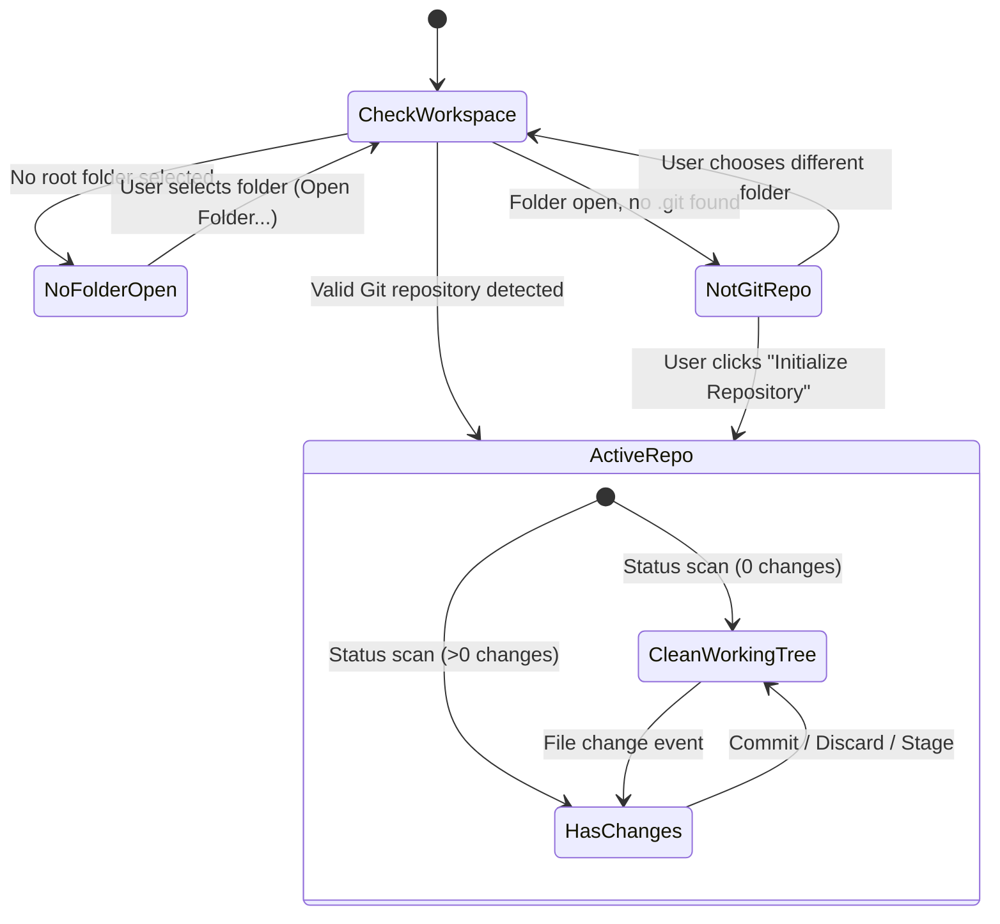

# Source Control & Git Panel Specification

> **Status:** Proposed  
> **Topic:** Source Control Panel, Gitoxide Integration, Micro Diff Tabs & AI Git Tools  
> **Scope:** `apps/terminal`, `crates/gencore-plugin-git`, `crates/gencore-plugin-assistant`, `packages/ui-kit`  

---

## 1. Overview & Goals

GenCore Terminal’s left side panel currently provides **Files**, **Assistant**, and **Config** tabs. This specification introduces:

1. **Top Icon Subview Toolbar on the Files Tab:**
   - 2 main subview buttons: **File Tree / Explorer** (`Folder` icon) and **Source Control** (`GitBranch` / `GitPullRequest` icon).
   - Right-side overflow dropdown menu with quick actions ("Open Workspace Folder...", "Initialize Repository", "Switch/Create Branch", "Stash Changes", "Stage/Unstage All", "Refresh").
2. **VSCode / Cursor-Style Source Control Panel:**
   - Empty state when no folder is open with an "Open Folder..." action button.
   - Uninitialized state when the opened folder is not a git repo with an "Initialize Repository" button (`git init`).
   - Active repository view featuring:
     - Branch chip with ahead/behind counters (`🌿 main ↑1 ↓0`).
     - Commit message textarea with "Commit" and "AI Generate Commit Message" buttons.
     - Collapsible groups for **Staged Changes**, **Changes (Working Tree)**, **Untracked Files**, and **Merge Conflicts**.
     - Per-file hover actions: Stage (`+`), Unstage (`-`), Discard changes (`↩`), Delete untracked (`🗑`).
     - Integrated interactive **Git Graph** section at the bottom showing branch tracks, commit nodes, author, timestamp, commit hashes, and refs.
3. **Dedicated Micro Diff / Editor Terminal Tabs:**
   - Clicking a modified or staged file opens a dedicated terminal tab in the right pane running bundled portable `micro` with Nord theme syntax highlighting, allowing direct inspection and editing.
4. **Rust Git Backend (`crates/gencore-plugin-git`):**
   - Implemented using pure Rust `gitoxide` (`gix`) for status, staging, committing, branch management, stashes, and revision graph traversal.
   - Exposed to frontend via typed Isolation IPC (`src/modules/ipc/ipc.git.ts`).
5. **AI Assistant Integration:**
   - Conventional commit message generator from staged diffs.
   - Propose-and-confirm Git tools for Gemini (`git_stage`, `git_commit`, `git_create_branch`, `git_stash`).
   - Repository status (branch, modified/staged count) included in Assistant conversation snapshots.

---

## 2. UI / UX Architecture

### 2.1 Files Tab Top Toolbar (`FilesToolbar`)
- **Container:** `h-9` flex row matching `ConfigToolbar` with `border-b border-border/60 bg-card px-2`.
- **Subviews:**
  - `tree` (Explorer): Displays the multi-drive or workspace folder file tree.
  - `git` (Source Control): Displays the Source Control panel.
- **Right Dropdown Menu:**
  - `Open Workspace Folder...` (opens native folder picker).
  - Separator.
  - `Branch: <current>` submenu (Create Branch, Switch Branch, Checkout).
  - `Stash` submenu (Stash Changes, Pop Stash).
  - `Stage All` / `Unstage All` / `Discard All`.
  - `Refresh`.

### 2.2 Source Control View State Machine
The Source Control view renders one of four distinct states:



### 2.3 Micro Diff Terminal Tab Workflow
When a file is clicked in the Source Control panel:
1. Frontend requests opening a diff tab for `file_path`.
2. A new terminal tab is added with `kind: "editor"` and title `📝 <filename>`.
3. PTY spawns `micro.exe <file_path>` inside the workspace working directory.
4. The user can view the file, edit code, save with `Ctrl+S`, and close the tab with `Ctrl+Q` or the tab close button (`✕`).

---

## 3. Rust Backend Plugin (`crates/gencore-plugin-git`)

### 3.1 Plugin Definition
- **Crate Directory:** `crates/gencore-plugin-git`
- **Package Name:** `gencore-plugin-git`
- **Tauri Plugin ID:** `gencore-git` (strictly matching `CARGO_PKG_NAME`)
- **Workspace Cargo.toml:** Added to `members` list.

### 3.2 IPC Commands

| Command | Arguments | Return Type | Description |
| :--- | :--- | :--- | :--- |
| `git_get_status` | `path: String` | `GitStatusResult` | Staged, unstaged, untracked, branch, ahead/behind |
| `git_stage_file` | `repo_path: String, file_path: String` | `()` | Stages a single file (`git add`) |
| `git_unstage_file` | `repo_path: String, file_path: String` | `()` | Unstages a single file (`git reset HEAD <file>`) |
| `git_stage_all` | `repo_path: String` | `()` | Stages all modified and untracked files |
| `git_unstage_all` | `repo_path: String` | `()` | Unstages all staged files |
| `git_discard_changes` | `repo_path: String, file_path: String` | `()` | Reverts working tree changes for a file |
| `git_commit` | `repo_path: String, message: String, amend: bool` | `GitCommitResult` | Creates a commit with staged files |
| `git_init_repo` | `path: String` | `()` | Initializes a new git repository (`git init`) |
| `git_get_diff` | `repo_path: String, file_path: String, staged: bool` | `String` | Unified diff string for the file |
| `git_get_log` | `repo_path: String, limit: usize, skip: usize` | `Vec<GitCommitNode>` | Commits and parent hashes for graph |
| `git_list_branches` | `repo_path: String` | `Vec<GitBranchInfo>` | Local and remote branches |
| `git_checkout_branch`| `repo_path: String, name: String` | `()` | Checkouts an existing branch |
| `git_create_branch` | `repo_path: String, name: String` | `()` | Creates and switches to a new branch |
| `git_stash_save` | `repo_path: String, message: Option<String>` | `()` | Stashes working directory changes |
| `git_stash_pop` | `repo_path: String` | `()` | Applies and removes latest stash |
| `git_pick_folder` | none | `Option<String>` | Native Windows folder selection dialog |

### 3.3 Data Structures

```rust
#[derive(Debug, Clone, Serialize, Deserialize)]
pub struct GitStatusResult {
    pub is_repo: bool,
    pub root_path: Option<String>,
    pub branch: Option<String>,
    pub upstream: Option<String>,
    pub ahead: usize,
    pub behind: usize,
    pub staged: Vec<GitFileStatus>,
    pub unstaged: Vec<GitFileStatus>,
    pub untracked: Vec<String>,
    pub conflicted: Vec<String>,
}

#[derive(Debug, Clone, Serialize, Deserialize)]
pub struct GitFileStatus {
    pub path: String,
    pub status: String, // "modified" | "added" | "deleted" | "renamed"
    pub additions: usize,
    pub deletions: usize,
}

#[derive(Debug, Clone, Serialize, Deserialize)]
pub struct GitCommitNode {
    pub id: String,
    pub short_id: String,
    pub summary: String,
    pub author_name: String,
    pub author_email: String,
    pub timestamp: i64,
    pub parents: Vec<String>,
    pub refs: Vec<String>, // ["HEAD", "main", "tag: v0.1.0"]
}
```

---

## 4. AI Assistant Integration

1. **AI Commit Message Generation:**
   - Invokes `generate_commit_message` via `gencore-plugin-assistant` using staged diff context.
   - Formats message as Conventional Commit (e.g. `feat(terminal): add git source control panel`).
2. **Propose-and-Confirm Tools:**
   - `git_stage`: Proposes staging specific files or all.
   - `git_commit`: Proposes commit message; requires user click "Approve" before Rust creates commit.
   - `git_create_branch`: Proposes creating/switching branches.
   - `git_stash`: Proposes stashing current work.
3. **Snapshot Context:**
   - Conversation context snapshot includes active repository name, branch, and staged/modified file counts.

---

## 5. Security & Isolation

- **Isolation Pattern Hook:** `apps/terminal/isolation/isolation.hook.js` strictly allowlists `gencore-git` commands and validates all argument keys.
- **Capabilities:** `apps/terminal/src-tauri/capabilities/main.json` explicitly grants `gencore-git:allow-git-*` permissions without wildcard access.
- **Path Validation:** All paths checked against traversal and canonicalized before git operations.
