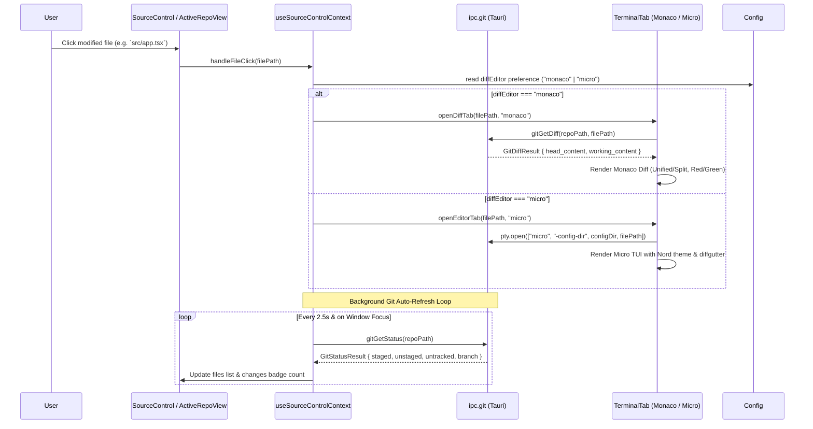

# Monaco & Micro Diff Editor, Config Preference, and Real-Time Source Control Specification

## Overview

This specification details the architecture, UI/UX design, configuration, and integration for the GenCore Terminal Git Diff and Source Control subsystems:
1. **Monaco Diff Editor:** An advanced, professional in-app React Diff Editor component embedded directly within terminal workspace tabs, featuring inline (unified) diffing by default (with red `#BF616A` deletions and green `#A3BE8C` additions), instant toggle to side-by-side (split) diffing, word-level inline diff chips, stage/discard action buttons, and official Nord theme tokens.
2. **Micro Editor (Simple TUI):** Bundled standalone `micro.exe` configured with an official Nord colorscheme (`nord.micro`), `diffgutter: true` for live green `+` / red `-` git gutter markers, and clean minimal statusline.
3. **Config Preference:** User setting in the Config tab allowing the user to select their default diff viewer (`"monaco"` vs `"micro"`), persisted in `TerminalConfigV1`.
4. **Real-Time Git Change Detection:** Active 2.5-second status polling + window focus listeners + terminal command execution hooks so modified/added/deleted files update automatically like VS Code Source Control.
5. **Open Repository Button:** Prominent `FolderOpen` icon button placed directly in the `ActiveRepoView` branch header for seamless 1-click repository/folder switching when a repository is already active.

---

## Architectural Design

### 1. Monaco Diff Editor Component (`src/modules/diff-editor/`)
- **Structure:**
  - `diff-editor.component.tsx`: Main React component wrapping `@monaco-editor/react` (or local `monaco-editor`), registering the Nord theme (`gencore-polar-night` and `gencore-snow-storm`), setting up line/word diffing models, and rendering the top diff action bar.
  - `diff-editor.hook.ts`: Fetches `git_get_diff` (HEAD content vs working content) via `ipc.git.ts`, manages unified/split view state, and handles staging/discarding.
  - `diff-editor.types.ts`: Type definitions for diff view options, file paths, diff models, and action callbacks.
  - `diff-editor.theme.ts`: Custom Monaco editor theme definitions mapping Nord 16 hex tokens:
    - Background: `#2E3440` (Polar Night 0)
    - Foreground: `#D8DEE9` (Snow Storm 0)
    - Deleted line background: `rgba(191, 97, 106, 0.20)` (Aurora Red)
    - Deleted word highlight: `rgba(191, 97, 106, 0.40)`
    - Added line background: `rgba(163, 190, 140, 0.20)` (Aurora Green)
    - Added word highlight: `rgba(163, 190, 140, 0.40)`
    - Gutter / Line numbers: `#4C566A` (Polar Night 3) / `#616E88`
    - Selection / Cursor: `#434C5E` / `#88C0D0` (Frost 2)
- **Top Diff Action Bar:**
  - File path display with status chip (Modified / Added / Deleted).
  - Mode switch: "Unified" (default) / "Split".
  - "Edit in Micro" button: Immediately switches tab/session to Micro editor on the same file.
  - "Discard" button: Reverts changes for this file with a confirmation tooltip.
  - "Stage / Unstage" button: Calls `stageFile` / `unstageFile` and reloads status.

### 2. Micro Editor Bundling & Configuration (`resources/micro/`)
- **Configuration Directory:** `apps/terminal/src-tauri/resources/micro/config/`
  - `settings.json`:
    ```json
    {
      "colorscheme": "nord",
      "diffgutter": true,
      "softwrap": true,
      "statusformatl": "$(filename) $(modified)",
      "statusformatr": "$(line):$(col) | $(opt:encoding) | $(opt:filetype)",
      "tabsize": 2,
      "tabstospaces": true,
      "scrollbar": false
    }
    ```
  - `colorschemes/nord.micro`:
    ```micro
    color-link default "#D8DEE9,#2E3440"
    color-link comment "#4C566A"
    color-link identifier "#88C0D0"
    color-link constant "#81A1C1"
    color-link statement "#81A1C1"
    color-link symbol "#81A1C1"
    color-link preproc "#5E81AC"
    color-link type "#8FBCBB"
    color-link special "#B48EAD"
    color-link underlined "#88C0D0"
    color-link error "bold #BF616A"
    color-link todo "bold #EBCB8B"
    color-link statusline "#D8DEE9,#3B4252"
    color-link tabbar "#D8DEE9,#2E3440"
    color-link line-number "#4C566A,#2E3440"
    color-link current-line-number "#ECEFF4,#3B4252"
    color-link diff-added "#A3BE8C"
    color-link diff-modified "#EBCB8B"
    color-link diff-deleted "#BF616A"
    color-link gutter-error "#BF616A"
    color-link gutter-warning "#EBCB8B"
    color-link cursor-line "#3B4252"
    color-link color-column "#3B4252"
    ```
- **Session Spawning:** `crates/gencore-plugin-pty` passes `-config-dir <resource_dir>/micro/config` or sets `MICRO_CONFIG_DIR` when spawning micro commands.

### 3. Config Tab Preferences
- **Config Storage:** Extend `TerminalConfigV1` in `config.types.ts`:
  ```ts
  export type DiffEditorPreference = "monaco" | "micro";
  
  export interface TerminalConfigV1 {
    // ... existing fields
    diffEditor: DiffEditorPreference;
  }
  ```
- **Config UI:**
  - Add a dedicated "Diff & Editor" card in `AppearanceView` (and in `AllSettingsView`) with interactive choice cards for Monaco (Advanced) vs Micro (Simple).
  - Persist automatically in localStorage via `config.storage.ts`.

### 4. Real-Time Git State Detection
- In `source-control.hook.ts`:
  - Active background polling interval (2500ms) that queries `gitGetStatus(folderPath)` when the document is visible and tab is open.
  - Event listener on `window.addEventListener("focus", ...)` for instant refresh when returning to GenCore.
  - Global event listener / trigger for terminal command executions.
  - Changes badge dynamically updated on the Files subview toolbar icon.

### 5. Header "Open Repository" Action
- In `ActiveRepoView` header (next to branch button and refresh button):
  - Add a sleek `Button` with `FolderOpen` icon and "Open Repository..." tooltip.
  - Clicking invokes `openFolderPicker()` to switch workspaces effortlessly.
  - Also wire `onOpenFolder` and `hasWorkspaceFolder` to the top `FilesToolbar` dropdown menu.

---

## Data Flow



---

## Error Handling & Edge Cases

1. **Untracked / New Files Diff:**
   - For new/untracked files, `head_content` is empty string; Monaco diff renders the whole file as added (green lines).
2. **Deleted Files:**
   - `working_content` is empty; Monaco diff renders the original content as deleted (red lines).
3. **Binary / Non-UTF8 Files:**
   - If diff contents cannot be decoded as UTF-8 or exceed 2MB, display a clean fallback notice: "Binary file or file too large to preview diff. Click to view in Explorer."
4. **Offline / Security Sandbox:**
   - Monaco is bundled locally with Vite workers (no external CDN calls); CSP `font-src: 'self'` and `connect-src: 'self'` remain strictly satisfied.
5. **Micro Configuration Fallback:**
   - If custom config directory is missing, `micro.exe` falls back gracefully to default internal defaults without crashing.

---

## Verification Plan

### Automated Tests
1. **IPC & Unit Tests:**
   - `apps/terminal/tests/unit/diff-editor.test.tsx`: Verify Monaco Diff Editor mounts, applies Nord colors, switches unified/split modes, and triggers stage/discard.
   - `apps/terminal/tests/unit/source-control.auto-refresh.test.tsx`: Test auto-polling and window focus status refresh.
   - `apps/terminal/tests/unit/config.diff-editor.test.ts`: Test `diffEditor` preference storage and defaults.
2. **Monorepo Checks:**
   - `pnpm turbo run lint typecheck test`
   - `cargo test --workspace`
   - `cargo clippy --workspace --all-targets -- -D warnings`

### Visual & Manual Verification
- Visual inspection in running WebView2 dev environment (`http://localhost:5173` / remote debugging port 9223):
  1. Open a modified git file -> verify Monaco opens with unified diff, red deletions, green additions.
  2. Switch to split view -> verify side-by-side panes with synced scroll.
  3. Click "Edit in Micro" -> verify micro launches in terminal pane with Nord colors and diffgutter.
  4. Test "Open Repository..." button in branch header.
  5. Edit a file externally -> verify Source Control updates automatically within 2.5s.
